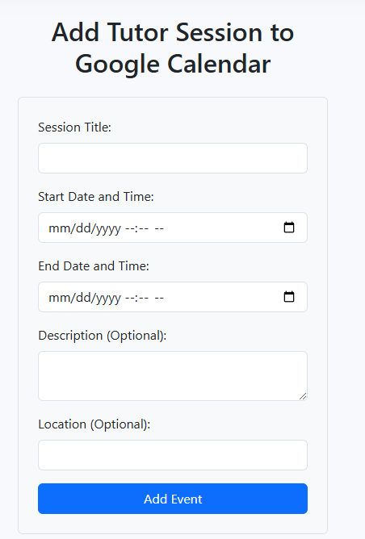
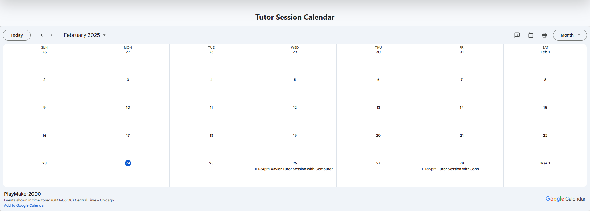
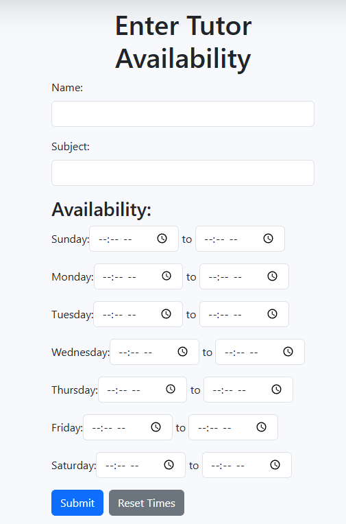
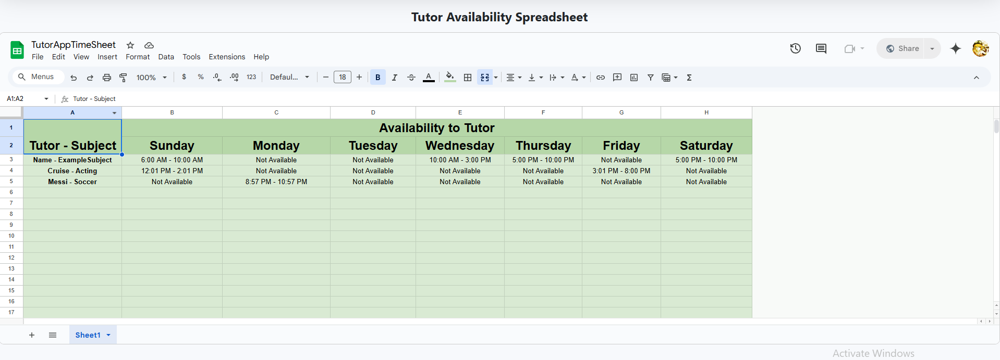

<!-- PROJECT LOGO -->
 

  <h3 align="center">Tutor Connect</h3>

  

    A website that helps brings tutors and students together

<!-- ABOUT THE PROJECT -->
## About The Project

This website deployed on render allows a student to schedule tutoring sessions with the google calendar API while tutors are allowed to share their availability using google sheets API. 

## Usage

Here is how students will be able to use this website. They'll use a form to schedule a session then it will show in the calendar tab.

Here is how tutors will be able to use this website. They'll use a form that will take in what their name is, what subject they will be tutoring and hours on what days they'll be available to tutor.

(<a href="#readme-top">back to top</a>)

### Built With

* Visual Studio Code
* HTML
* Javascript
* CSS
* Bootstrap
* Render
* SQL
* Node
* React
* Google API's

(<a href="#readme-top">back to top</a>)

<!-- CONTACT -->
## Group members

<li>Xavier Vang 
<li>James Lee
<li>Zach Taylor
<li>Guy Terry

Project Link: [https://github.com/Ferumbruh/TutorConnect.git](https://github.com/Ferumbruh/TutorConnect.git)

Deployed Application: [https://tutorconnectfrontend.onrender.com](https://tutorconnectfrontend.onrender.com)

(<a href="#readme-top">back to top</a>)
